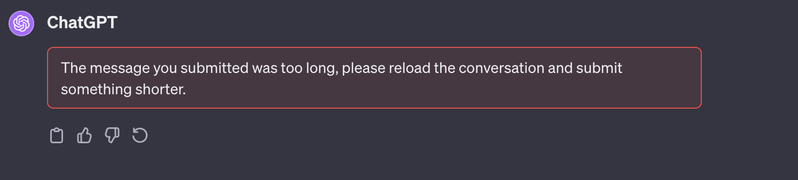
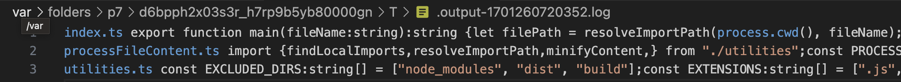
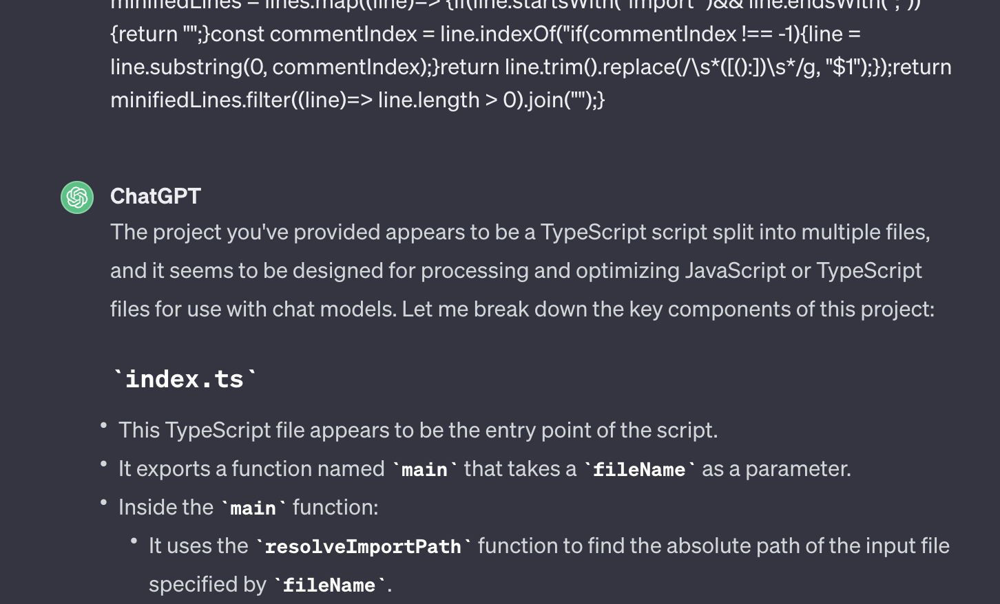

# chatgpt-filehelper

## Description

`chatgpt-filehelper` is an easy to use tool for optimizing JavaScript and TypeScript files for use with Large Language Models like ChatGPT, Bard, Claude, etc..

It removes unnecessary whitespace and characters, and combines imported files into one long text file, making it easier to work with models that have token limits for input, and saving the hassle of copy-pasting multiple files related to the file you're working on.

## Demo

As an example, say I want to ask ChatGPT about the following file:

```ts
import * as fs from "fs";
import * as path from "path";
import * as os from "os";
import { processFileContent } from "./processFileContent";
import { resolveImportPath, searchForInputFile } from "./utilities";

export function main(fileName: string): string {
  let filePath = resolveImportPath(process.cwd(), fileName);
  //etc ...
```

ChatGPT won't know about `processFileContent` or `resolveImportPath` unless they're uploaded too, and the imports of those files as well.

Also, copy pasting all of those files may result in an error.



Using this tool by running `npm run gpt index.ts`, will generate a long minifed file that is hard to read for us but easy to read by ChatGPT. Simply copy paste it and ask questions knowing the GPT has the full context.






## Installation

To use `chatgpt-filehelper`, follow these installation steps:

1. Ensure that you have Node.js and npm (Node Package Manager) installed on your system.

2. Clone the repo `git clone https://github.com/daviddigital/chatgpt-filehelper`

3. Change into the directory `cd chatgpt-filehelper`

4. Install the dependencies `npm install`

5. Add the following script to your `package.json`

```
"scripts": {
    "gpt": "node dist/index.js",
}
```

## Usage

After installation, you can shrink JavaScript or TypeScript files along with all of their non-node-module imports using the following command:

`npm run gpt your-file.js`

Replace `your-file.js` with the file you want to optimize. Chatgpt-filehelper will search your current folder and subfolders for the filename so the path isn't required but must be unique.

## How It Works

This package employs several techniques to optimize the file:

- It removes unnecessary whitespace, comments and new lines from the code, without using standard minification which GPTs struggle with.
- It combines all import statements into a single text file, appending the filename, preserving their order.

This results in a more compact file that can be used as input for chat models without exceeding token limits and giving full context of imported files.

## Further improvements

Add support for other file types / languages to handle imports in those languages.

## Contributing

If you'd like to contribute to this project or report issues, please visit the [GitHub repository](https://github.com/daviddigital/chatgpt-filehelper).

## License

This package is open-source and available under the [MIT License](LICENSE).

---

Thank you for using `chatgpt-filehelper`! If you have any questions or encounter any issues, feel free to reach out to the project's maintainers or open an issue on the GitHub repository. Happy coding!
